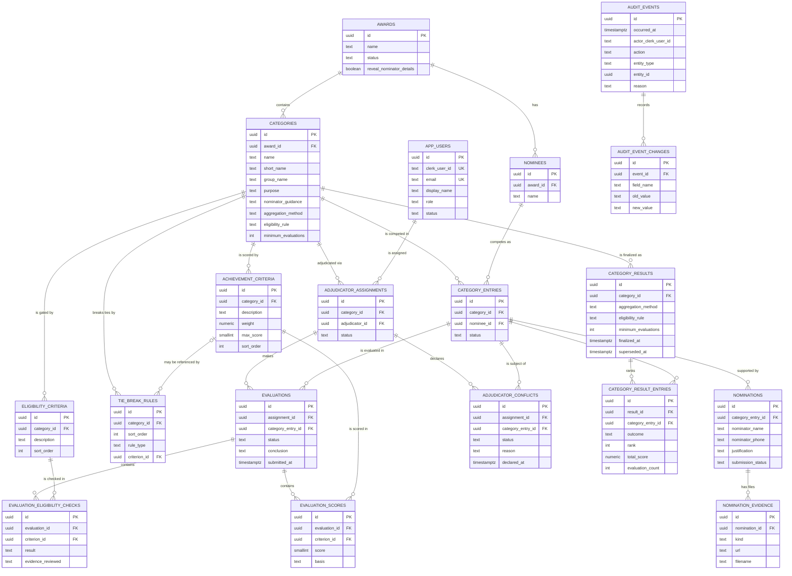

# Domain model (revision 3)

Status: **ready for implementation review**. No migrations, SQLAlchemy models, endpoints or tables exist yet.

This document describes the PostgreSQL data model for awards adjudication. It is designed so that every adjudicator's independent evaluation is retained and auditable, and category results are an immutable snapshot derived from those evaluations rather than a replacement for them.

Sources: the MOBA@150 Nominee Evaluation Framework (16 workbooks in `backend/docs/MOBA@150 Awards_Nominee Evaluation Framework/`, not committed), the sample nominations, and the decisions recorded in review.

## What changed in revision 3

- **Terminology:** `judge` is now `adjudicator` everywhere (role, `adjudicator_id`, table `adjudicator_assignments`). The award lifecycle status `judging` is unchanged.
- **Independence:** each adjudicator evaluates independently and cannot see anyone else's evaluation or scores.
- **Eligibility:** category entry status (administrative), an evaluation's eligibility outcome (derived) and a candidate's final outcome (snapshot) are three separate things.
- **Scoring:** achievement scores are whole numbers; no aggregation method is hard-coded. Aggregation, eligibility rule, minimum evaluations and tie-break rules are configuration recorded on the result when it is finalized.
- **Conflict of interest:** new `adjudicator_conflicts` table.
- **Evaluation lifecycle:** submitted evaluations are immutable to the adjudicator; an admin can reopen one only with a reason.
- **Finalization:** a documented workflow that produces an immutable snapshot and records who, when and how.
- **Audit:** a full action catalogue, with database-enforced reasons for the most sensitive actions.

## 1. What the source material tells us

### 1.1 Nominations (sample data)

| Sample field | Meaning |
| --- | --- |
| `id` (UUID) | Identifier of one nomination submission |
| `nominee_name` | Free-text name of the person or organisation nominated |
| `award_category` | Name of the category being nominated for |
| `justification` | Long free text (up to several thousand characters, with line breaks) |
| `nominator_name` | Free-text name of whoever submitted it |
| `nominator_phone` | Nominator's phone number (being added to the data) |
| `supporting_evidence[]` | Files hosted on the old WordPress site: `kind` (image or document), `url`, `filename` |
| `submission_status` | Only the value `independent` has been seen |

Consequences:

1. **The named awards are categories.** The overall programme is the "Award" in this model and contains the 16 categories.
2. **A record is a nomination, not a nominee.** A nominee can be nominated by several people and in several categories. Adjudicators assess a nominee once per category, so nominations are separated from the thing being assessed (a *category entry*).
3. **Nominators are outside people, not app users.** Their name and phone are stored as text on the nomination.

### 1.2 Evaluation framework (the 16 workbooks)

The framework speaks of a *Technical Review Panel* and *reviewers*. In this model they are **adjudicators**. Every workbook follows one template per category:

- **Category background:** an *award purpose* and a *proposer context*, both free text.
- **Eligibility criteria:** 1 to 6 statements, each assessed **Pass or Fail** with an "evidence reviewed" note and comments.
- **Achievement criteria:** 2 to 5 statements, each with a **weight** and a **score from 0 to 5** with a written basis. In all 16 categories the weights add up to exactly 100%. A criterion's weighted score is `weight × score ÷ 5 × 100`, so a total is out of 100.
- **Gate:** achievement scores only count where eligibility passes.
- **Scoring guide:** 0 No evidence, 1 Limited, 2 Developing, 3 Meets expectation, 4 Strong, 5 Exceptional.
- **Per-nominee record:** nominators, reviewer, status, overall eligibility, final score and a written conclusion.
- **Draft status:** the framework says criteria, weights, scale and tie-break rules are a **draft** the panel will finalize. **They must therefore be editable configuration, not fixed in code.** The workbooks are the initial data.
- **Grouping:** each category belongs to a group: Distinguished Alumnus, Sector / Impact, Special / Individual, Special / Institutional, or Staff.

## 2. The 16 categories

| Official name (from the workbooks) | Group | Eligibility criteria | Achievement criteria |
| --- | --- | --- | --- |
| Distinguished Alumnus – Academia and Research | Distinguished Alumnus | 6 | 5 |
| Distinguished Alumnus – Arts and Cultural Excellence | Distinguished Alumnus | 6 | 5 |
| Distinguished Alumnus – Business and Entrepreneurship | Distinguished Alumnus | 6 | 5 |
| Distinguished Alumnus – Public Service and Governance | Distinguished Alumnus | 6 | 5 |
| Education Impact Award | Sector / Impact | 1 | 3 |
| Environmental Sustainability Award | Sector / Impact | 3 | 5 |
| Media and Communications Excellence Award | Sector / Impact | 1 | 2 |
| Science, Technology and Innovation Award | Sector / Impact | 4 | 5 |
| Sports Excellence Award | Sector / Impact | 5 | 2 |
| Emerging Alumnus Leadership Award | Special / Individual | 6 | 3 |
| MOBA Fraternity Award | Special / Individual | 5 | 4 |
| MOBA International Ambassador Award | Special / Individual | 5 | 5 |
| Distinguished Edzikanfo Award | Special / Institutional | 4 | 5 |
| Partner of Impact Award | Special / Institutional | 2 | 3 |
| Outstanding Teaching Staff Award | Staff | 2 | 3 |
| Outstanding Non-Teaching Staff Award | Staff | 5 | 5 |

Notes:

- The workbooks give the official names; the model stores both a `name` and a `short_name` (for example "Edzikanfo").
- Several categories accept groups, associations or institutions, so a nominee is a **person or an organisation**.
- Some eligibility statements are themselves conflict-of-interest rules ("no nominee may be a member of the selection committee"). They stay as ordinary pass/fail criteria. The conflict mechanism in 4.5 is separate: it lets an adjudicator declare a personal conflict on a specific category entry.

## 3. Conventions

- **Primary keys:** `uuid`, generated by the database (`gen_random_uuid()`). `nominations.id` keeps the UUID from the source data on import.
- **Timestamps:** every mutable table has `created_at` and `updated_at` (`timestamptz`, not null, default `now()`). Append-only tables have only a creation time.
- **Dates:** business dates (nomination received, adjudication window, final review date) are deliberately left out until you add them.
- **Clerk users:** referenced by `clerk_user_id text`. No passwords or credentials are stored; Clerk remains responsible for authentication and invitations. Where the relationship matters to the business (an adjudicator is assigned to a category), the row references `app_users`. Where we only record *who did something*, we store the plain Clerk ID so history survives.
- **Statuses:** `text` columns with a `CHECK` constraint listing allowed values, not native enums, because a CHECK is easy to extend in a migration.
- **Foreign keys:** `ON DELETE RESTRICT` by default. Records that have entered adjudication are withdrawn, revoked or superseded with a status, never deleted. The only cascades are on snapshot children (`category_result_entries`, `audit_event_changes`).
- **No JSON columns.** Everything, including audit before/after values, is relational.
- **Numbers:** `numeric` for weights and totals, `smallint` for whole-number scores. Never floating point.
- **Derived values are computed, not stored** (an evaluation's eligibility outcome, weighted scores, totals). The only place derived values are stored is the finalized result snapshot.
- **Configuration, not code:** criteria, weights, the scoring scale, the aggregation method, the eligibility rule, the minimum number of evaluations and tie-break rules are all rows or columns that admins edit. Where a setting names a method, the application keeps a registry of the methods it implements, and the database stores only the chosen identifier (no CHECK on the list, so adding a method needs no migration). No method is named or defaulted in this document.

## 4. Entities by layer

### 4.1 Award configuration

**`awards`**: the programme (expected to be a single row).

| Column | Type | Notes |
| --- | --- | --- |
| `id` | uuid PK | |
| `name` | text, not null | |
| `description` | text | |
| `status` | text, not null | `draft`, `nominations`, `judging`, `finalized`, `archived`. **Adjudication begins when this becomes `judging`** |
| `reveal_nominator_details` | boolean, not null, default false | Admin switch. See 4.9 |
| `created_by_clerk_user_id` | text | |
| `created_at`, `updated_at` | timestamptz | |

**`categories`**: the 16 categories.

| Column | Type | Notes |
| --- | --- | --- |
| `id` | uuid PK | |
| `award_id` | uuid FK → awards | |
| `name` | text, not null | Official name; unique per `award_id` |
| `short_name` | text, not null | |
| `group_name` | text, not null | The five groups (text, since groups have no attributes of their own) |
| `purpose` | text | "Award purpose" from the framework |
| `nominator_guidance` | text | "Proposer/support context" from the framework |
| `aggregation_method` | text, null | How adjudicators' totals combine into a category score. Chosen by an admin from the application's registry. No default |
| `eligibility_rule` | text, null | How adjudicators' individual eligibility outcomes combine into the candidate's final eligibility. No default |
| `minimum_evaluations` | integer, null | `CHECK (minimum_evaluations >= 1)`. Fewest counted evaluations for a candidate to be ranked |
| `sort_order` | integer | |
| `created_at`, `updated_at` | timestamptz | |

The three configuration columns are null until an admin sets them and must all be set before a category can be finalized.

**`eligibility_criteria`**: pass/fail statements.

| Column | Type | Notes |
| --- | --- | --- |
| `id` | uuid PK | |
| `category_id` | uuid FK → categories | |
| `description` | text, not null | The statement as written |
| `sort_order` | integer, not null | unique per `category_id` |
| `created_at`, `updated_at` | timestamptz | |

**`achievement_criteria`**: weighted, scored on a whole-number scale.

| Column | Type | Notes |
| --- | --- | --- |
| `id` | uuid PK | |
| `category_id` | uuid FK → categories | |
| `description` | text, not null | |
| `weight` | numeric(5,4), not null | Fraction of 1, `CHECK (weight > 0 AND weight <= 1)`. A category's weights must total 1.0 |
| `weight_rationale` | text | "Weight justification benchmark" from the framework |
| `max_score` | smallint, not null, default 5 | `CHECK (max_score > 0)`. The top of the scale; the framework uses 0–5. The scale is data, not code |
| `sort_order` | integer, not null | unique per `category_id` |
| `created_at`, `updated_at` | timestamptz | |

**`tie_break_rules`**: ordered rules applied when candidates have equal totals. The panel has not yet chosen any, so a category with no rows lets tied candidates share a rank.

| Column | Type | Notes |
| --- | --- | --- |
| `id` | uuid PK | |
| `category_id` | uuid FK → categories | |
| `sort_order` | integer, not null | unique together with `category_id`. Lower is applied first |
| `rule_type` | text, not null | Identifier from the application's registry |
| `criterion_id` | uuid FK → achievement_criteria, null | For rules that refer to one criterion (for example "higher score on this criterion") |
| `created_at`, `updated_at` | timestamptz | |

The scoring guide (0 No evidence … 5 Exceptional, with thresholds) is the same everywhere and is shown in the UI as reference text. It does not need a table unless the panel wants it changed.

**When configuration can change**

| Configuration | Editable by admins | Frozen |
| --- | --- | --- |
| Eligibility criteria, achievement criteria, weights, `max_score` | While the award is `draft` or `nominations` | Once the award is `judging` |
| `aggregation_method`, `eligibility_rule`, `minimum_evaluations`, `tie_break_rules` | Until the category is finalized | While the category has a current (non-superseded) result |

"Weights total 1.0" spans rows, so the service layer checks it when the award moves to `judging`. It is covered by tests. Every configuration change is audited (see 4.8).

### 4.2 Nominee and submission data

**`nominees`**: a person or organisation being nominated.

| Column | Type | Notes |
| --- | --- | --- |
| `id` | uuid PK | |
| `award_id` | uuid FK → awards | |
| `name` | text, not null | Index on `lower(name)` to help spot duplicates |
| `created_at`, `updated_at` | timestamptz | |

**`category_entries`**: a nominee competing in one category. **This is the thing adjudicators assess.** A nominee can have several category entries, one per category.

| Column | Type | Notes |
| --- | --- | --- |
| `id` | uuid PK | |
| `category_id` | uuid FK → categories | |
| `nominee_id` | uuid FK → nominees | unique together with `category_id` |
| `status` | text, not null | **Administrative only:** `pending`, `accepted`, `rejected`, `withdrawn`. Only `accepted` category entries are assessed. It says nothing about eligibility (see 4.4) |
| `status_reason` | text | Required when `rejected` or `withdrawn` (service layer) |
| `created_at`, `updated_at` | timestamptz | |

**`nominations`**: one submission by one nominator for a category entry. One record of the sample data.

| Column | Type | Notes |
| --- | --- | --- |
| `id` | uuid PK | Keeps the source UUID on import |
| `category_entry_id` | uuid FK → category_entries | |
| `nominator_name` | text, not null | Hidden from adjudicators while `awards.reveal_nominator_details` is false |
| `nominator_phone` | text, null | Same |
| `justification` | text, not null | |
| `submission_status` | text, not null | Source value, `independent` so far. No CHECK until all values are known |
| `created_at`, `updated_at` | timestamptz | |

**`nomination_evidence`**: files supporting a nomination.

| Column | Type | Notes |
| --- | --- | --- |
| `id` | uuid PK | |
| `nomination_id` | uuid FK → nominations | |
| `kind` | text, not null | `image`, `document` |
| `url` | text, not null | The existing external (WordPress) URL |
| `filename` | text, not null | |
| `created_at` | timestamptz | |

Evidence stays as external URLs and **no file storage system is introduced**. The links work only while the old site stays online.

### 4.3 People and adjudicator assignments

**`app_users`**: people with a role in this system.

| Column | Type | Notes |
| --- | --- | --- |
| `id` | uuid PK | |
| `clerk_user_id` | text, null | Unique when not null. Empty until the invitee accepts and first signs in |
| `email` | text, not null | Unique. Used for the invitation and to link the account on first sign-in |
| `display_name` | text, not null | |
| `role` | text, not null | `admin`, `adjudicator`. One role per person |
| `status` | text, not null | `invited`, `active`, `deactivated` |
| `invited_by_clerk_user_id` | text | |
| `invited_at` | timestamptz | |
| `created_at`, `updated_at` | timestamptz | |

**`adjudicator_assignments`**: an adjudicator assigned to a category.

| Column | Type | Notes |
| --- | --- | --- |
| `id` | uuid PK | |
| `category_id` | uuid FK → categories | unique together with `adjudicator_id` |
| `adjudicator_id` | uuid FK → app_users | Must be a user with role `adjudicator` (service layer) |
| `status` | text, not null | `active`, `revoked` |
| `assigned_by_clerk_user_id` | text | |
| `assigned_at` | timestamptz | |
| `revoked_at` | timestamptz, null | |
| `created_at`, `updated_at` | timestamptz | |

**Access rules** (enforced in the service layer on every request, never only in the UI):

- An adjudicator can access **only accepted category entries in categories where they have an `active` assignment**. Lists and lookups are filtered by assignment.
- An adjudicator can read and write **only their own evaluations** and can declare conflicts for their own assignments. Details in 4.4 and 4.5.
- A revoked assignment blocks all further access and edits. Its **submitted evaluations are kept and still counted** (they were valid when made); its drafts are excluded from aggregation.
- Anyone signed in through Clerk who has no `app_users` row gets 403.
- There is no separate validator role. Admins can read everything.

### 4.4 Evaluation data

One **evaluation** is one adjudicator's independent assessment of one category entry. It has three parts: eligibility checks, achievement scores and a conclusion.

**`evaluations`**

| Column | Type | Notes |
| --- | --- | --- |
| `id` | uuid PK | |
| `assignment_id` | uuid FK → adjudicator_assignments | unique together with `category_entry_id` |
| `category_entry_id` | uuid FK → category_entries | |
| `status` | text, not null | `draft`, `submitted`, `reopened`. No row yet means "not started" |
| `conclusion` | text | Written conclusion (the framework's "reviewer conclusion") |
| `submitted_at` | timestamptz, null | `CHECK (status <> 'submitted' OR submitted_at IS NOT NULL)` |
| `created_at`, `updated_at` | timestamptz | |

The unique constraint means **each adjudicator has at most one evaluation per assigned category entry**.

**`evaluation_eligibility_checks`**: one row per eligibility criterion.

| Column | Type | Notes |
| --- | --- | --- |
| `id` | uuid PK | |
| `evaluation_id` | uuid FK → evaluations | unique together with `criterion_id` |
| `criterion_id` | uuid FK → eligibility_criteria | |
| `result` | text, null | `pass` or `fail`. Null while not yet assessed |
| `evidence_reviewed` | text | |
| `comment` | text | |
| `created_at`, `updated_at` | timestamptz | |

**`evaluation_scores`**: one row per achievement criterion. These are the individual scores that are never discarded.

| Column | Type | Notes |
| --- | --- | --- |
| `id` | uuid PK | |
| `evaluation_id` | uuid FK → evaluations | unique together with `criterion_id` |
| `criterion_id` | uuid FK → achievement_criteria | |
| `score` | smallint, null | Whole number, `CHECK (score >= 0)`. Null while not yet scored |
| `basis` | text | The written basis for the score |
| `created_at`, `updated_at` | timestamptz | |

Rules that span tables are enforced in the service layer and covered by tests (a trigger can be added later):

- The assignment's category, the category entry's category and each criterion's category must all be the same.
- `score` must not exceed the criterion's `max_score`.
- Submitting requires every eligibility check to be assessed and, if the evaluation's eligibility outcome is `pass`, every score to be entered.
- Submitting is refused while a conflict is declared (4.5).

**Independence.** An adjudicator never sees another adjudicator's evaluation, checks, scores or conclusion, and never sees totals, rankings or results before they are finalized. This is enforced on every read in the service layer, and a request for someone else's evaluation returns 404, not 403, so its existence is not revealed.

**Derived, not stored:**

- An evaluation's *eligibility outcome*: `pass` if every check passes, `fail` if any fails, otherwise `incomplete`.
- A criterion's *weighted score* = `weight × score ÷ max_score × 100`, taken from the configured weight. An evaluation's *total* is the sum, out of 100.
- Totals count only where the evaluation's eligibility outcome is `pass`.

**Three different things.** These are easy to confuse, so they are kept apart:

| Concept | Where | Values | Stored? |
| --- | --- | --- | --- |
| Category entry status | `category_entries.status` | `pending`, `accepted`, `rejected`, `withdrawn` | Yes. Administrative decision |
| Evaluation eligibility outcome | Derived from one adjudicator's checks | `incomplete`, `pass`, `fail` | **No, derived** |
| Final category outcome | `category_result_entries.outcome` | `ranked`, `ineligible`, `insufficient_evaluations` | Yes, in the snapshot at finalization |

A candidate's final outcome is never copied from one adjudicator's result. It is produced by the category's configured `eligibility_rule` across all counted evaluations.

### 4.5 Conflicts of interest

**`adjudicator_conflicts`**: an adjudicator declares that they cannot fairly assess a category entry.

| Column | Type | Notes |
| --- | --- | --- |
| `id` | uuid PK | |
| `assignment_id` | uuid FK → adjudicator_assignments | unique together with `category_entry_id` |
| `category_entry_id` | uuid FK → category_entries | Must be in the assignment's category |
| `status` | text, not null | `declared`, `cleared` |
| `reason` | text, not null | The adjudicator's reason |
| `declared_at` | timestamptz, not null | |
| `cleared_at` | timestamptz, null | |
| `cleared_by_clerk_user_id` | text, null | |
| `clear_reason` | text, null | |
| `created_at`, `updated_at` | timestamptz | |

`CHECK (status <> 'cleared' OR (cleared_at IS NOT NULL AND cleared_by_clerk_user_id IS NOT NULL AND clear_reason IS NOT NULL))`

Rules (service layer, with tests):

- An adjudicator declares a conflict on a category entry in a category they are assigned to. **Only an admin can clear it, and must give a reason.**
- While a conflict is `declared`, that adjudicator **cannot create or submit an evaluation** for the category entry. An existing draft is locked.
- An evaluation that was already submitted when the conflict was declared is **excluded from aggregation** for as long as the conflict stands.
- Declaring and clearing are audited (`conflict.declared`, `conflict.cleared`).

### 4.6 Evaluation lifecycle

```
(no row) → draft → submitted → reopened → submitted → ...
```

- **Draft:** the assigned adjudicator edits freely. Draft edits are not audited.
- **Submit:** the adjudicator submits. From here the evaluation is **immutable to the adjudicator**. The submission is audited.
- **Reopen:** only an admin can reopen a submitted evaluation, and **must give a reason**. This is enforced in the database (see 4.8). Reopening is audited.
- **Changes after reopening:** every change to checks, scores or the conclusion is audited field by field, with old and new values, until the adjudicator submits again.
- **Locked while finalized:** an evaluation cannot be reopened while its category has a current result (see 4.7).

### 4.7 Finalization and results

Until a category is finalized, its standings are computed live from evaluations and shown to admins only. Finalizing creates an immutable snapshot.

**Finalization workflow** (one admin action per category, in a single database transaction):

1. **Preconditions.** The award is `judging`. The category's `aggregation_method`, `eligibility_rule` and `minimum_evaluations` are set. Every accepted category entry has at least `minimum_evaluations` submitted, non-conflicted evaluations, or is recorded as `insufficient_evaluations`.
2. **Evaluations are completed.** Every assigned adjudicator has submitted or declared a conflict for each accepted category entry.
3. **Eligibility outcomes are determined.** Each counted evaluation's eligibility outcome is derived from its checks. The configured `eligibility_rule` combines them into the candidate's final eligibility.
4. **Configured aggregation is applied.** The configured `aggregation_method` combines the totals of counted evaluations for eligible candidates, and the category's `tie_break_rules` are applied in order.
5. **The snapshot is generated.** One `category_results` row and one `category_result_entries` row for every accepted category entry are written, together with the audit event.
6. **Provenance is recorded.** The result stores who finalized it, when, and which aggregation method, eligibility rule and minimum evaluations were used.
7. **It is immutable afterwards.** Snapshot rows are never updated. While a current result exists, the following are blocked: reopening evaluations, changing criteria or category configuration, changing tie-break rules, and revoking assignments. Later changes therefore cannot silently alter a finalized result.
8. **Changing a finalized result** requires an admin to **supersede** it, with a reason. That is audited and marks the result superseded, after which the category can be edited and finalized again. The old snapshot is kept.

**`category_results`**

| Column | Type | Notes |
| --- | --- | --- |
| `id` | uuid PK | |
| `category_id` | uuid FK → categories | Only one row per category where `superseded_at IS NULL` (partial unique index) |
| `aggregation_method` | text, not null | Copied from the category at finalization |
| `eligibility_rule` | text, not null | Copied from the category at finalization |
| `minimum_evaluations` | integer, not null | Copied from the category at finalization |
| `finalized_at` | timestamptz, not null | |
| `finalized_by_clerk_user_id` | text, not null | |
| `superseded_at` | timestamptz, null | |
| `superseded_by_clerk_user_id` | text, null | |
| `supersede_reason` | text, null | `CHECK (superseded_at IS NULL OR (supersede_reason IS NOT NULL AND superseded_by_clerk_user_id IS NOT NULL))` |
| `created_at` | timestamptz | |

**`category_result_entries`**: one row per accepted category entry in the category.

| Column | Type | Notes |
| --- | --- | --- |
| `id` | uuid PK | |
| `result_id` | uuid FK → category_results, `ON DELETE CASCADE` | |
| `category_entry_id` | uuid FK → category_entries | unique together with `result_id` |
| `outcome` | text, not null | `ranked`, `ineligible`, `insufficient_evaluations`. The **final** outcome, not an adjudicator's |
| `rank` | integer, null | Ties share a rank unless a tie-break rule separates them |
| `total_score` | numeric(6,3), null | Out of 100 |
| `evaluation_count` | integer, not null | Counted (submitted, non-conflicted) evaluations |

`CHECK ((outcome = 'ranked') = (rank IS NOT NULL AND total_score IS NOT NULL))`

The totals are stored on purpose so a finalized result cannot change. Every evaluation behind them is kept in full.

### 4.8 Audit trail

**`audit_events`**: append-only.

| Column | Type | Notes |
| --- | --- | --- |
| `id` | uuid PK | |
| `occurred_at` | timestamptz, not null | |
| `actor_clerk_user_id` | text, not null | |
| `action` | text, not null | From the catalogue below |
| `entity_type` | text, not null | |
| `entity_id` | uuid, not null | Not a foreign key, so history survives any change to the target |
| `reason` | text, null | |

`CHECK (reason IS NOT NULL OR action NOT IN ('evaluation.reopened', 'conflict.cleared', 'result.superseded'))`

**`audit_event_changes`**: append-only, one row per changed field.

| Column | Type | Notes |
| --- | --- | --- |
| `id` | uuid PK | |
| `event_id` | uuid FK → audit_events, `ON DELETE CASCADE` | |
| `field_name` | text, not null | |
| `old_value`, `new_value` | text, null | Values stored as text |

**Action catalogue.** Every event is written in the same transaction as the change it describes.

| Area | Actions | Field changes recorded | Reason required |
| --- | --- | --- | --- |
| Awards and categories | `award.updated`, `award.status_changed`, `award.setting_changed` (nominator switch), `category.updated` | Yes | No |
| Criteria and configuration | `criteria.created`, `criteria.updated`, `criteria.deleted` (eligibility and achievement), `category.config_updated` (aggregation method, eligibility rule, minimum evaluations), `tie_break_rule.changed` | Yes | No |
| Nominees and nominations | `nominee.added`, `category_entry.status_changed`, `nomination.edited` | Yes | For rejected or withdrawn (service layer) |
| Adjudicators | `adjudicator.invited`, `adjudicator.deactivated`, `adjudicator.assigned`, `adjudicator.assignment_revoked` | Yes | No |
| Conflicts | `conflict.declared`, `conflict.cleared` | Yes | **Yes for `cleared` (database)** |
| Evaluations | `evaluation.submitted`, `evaluation.reopened`, `evaluation.updated_after_reopen` | Yes for updates after reopening | **Yes for `reopened` (database)** |
| Results | `result.finalized`, `result.superseded` | Yes (method and configuration used) | **Yes for `superseded` (database)** |

Audit tables are insert-only. Enforcing that at the database level (a trigger or revoked privileges) is a possible hardening step later.

### 4.9 Admin switch for nominator details

The nominator's **name and phone** are stored on each nomination. An admin can switch on or off whether adjudicators see them (for example to review blind).

- Stored as `awards.reveal_nominator_details`, default **off**. One flag on the award is enough for now; a general settings table is only worth adding when a second switch appears.
- Changed by an admin only, through `PATCH /api/v1/awards/{award_id}` with a body such as `{"reveal_nominator_details": true}` (partial update, per `RESTAPI.md`). A button in the admin screen calls it.
- **Enforced on the server, not the screen.** While off, API responses to adjudicators leave out `nominator_name` and `nominator_phone`. Hiding them only in the UI would still expose them in the network traffic.
- Every change is audited (`award.setting_changed`).

### 4.10 Inviting adjudicators

Adjudicators are invited by email through Clerk, so nobody can self-register.

- An admin adds an email. The backend creates an `app_users` row with status `invited` and sends a Clerk invitation. **This needs `CLERK_SECRET_KEY` on the backend (Render only).**
- Clerk sign-ups must be restricted to invited users in the Clerk dashboard.
- The invitation email leads to a sign-up page where the person **sets their password** (Clerk's standard invitation flow).
- On first sign-in, the backend matches the verified email to the `invited` row, stores the `clerk_user_id` and marks the user `active`. A signed-in user with no matching row gets 403.
- The first administrator is created outside the app, for example by a one-off script that inserts an `admin` row for your Clerk user ID.

## 5. Who belongs to whom

```
award
├── categories  (carry aggregation_method, eligibility_rule, minimum_evaluations)
│   ├── eligibility_criteria
│   ├── achievement_criteria
│   ├── tie_break_rules ──── achievement_criterion (optional)
│   ├── category_entries ──── nominee (belongs to the award; can have many category entries)
│   │   └── nominations
│   │       └── nomination_evidence
│   ├── adjudicator_assignments ──── app_users (adjudicator)
│   │   ├── evaluations ──── category_entry
│   │   │   ├── evaluation_eligibility_checks ──── eligibility_criterion
│   │   │   └── evaluation_scores ──── achievement_criterion
│   │   └── adjudicator_conflicts ──── category_entry
│   └── category_results
│       └── category_result_entries ──── category_entry
└── nominees

audit_events → audit_event_changes   (refer to any entity by type + id, no FK)
```

Deleting is avoided: a category entry is `withdrawn`, an assignment is `revoked`, a user is `deactivated`, a result is `superseded`.

## 6. ER diagram



## 7. Status fields

| Table.column | Values | Notes |
| --- | --- | --- |
| `awards.status` | `draft` → `nominations` → `judging` → `finalized` → `archived` | `judging` is when adjudication begins; criteria, weights and scale freeze then |
| `category_entries.status` | `pending`, `accepted`, `rejected`, `withdrawn` | Administrative. Only `accepted` is assessed |
| `app_users.status` | `invited` → `active` → `deactivated` | |
| `adjudicator_assignments.status` | `active`, `revoked` | Revoked rows are kept |
| `adjudicator_conflicts.status` | `declared` → `cleared` | Only an admin can clear |
| `evaluations.status` | `draft` → `submitted` → (`reopened` → `submitted`) | Reopening needs a reason |
| Evaluation eligibility outcome | `incomplete`, `pass`, `fail` | **Derived, not a column** |
| `evaluation_eligibility_checks.result` | `pass`, `fail`, null | Null = not yet assessed |
| `category_result_entries.outcome` | `ranked`, `ineligible`, `insufficient_evaluations` | The final outcome, set at finalization |
| `category_results.superseded_at` | null while current | Not a status column |
| `nominations.submission_status` | `independent` so far | Meaning unconfirmed |

## 8. Immutability and auditing

| What | Rule | Audited? | Why |
| --- | --- | --- | --- |
| Award and category edits | Editable while `draft`, then restricted | Yes | Changes what the programme means |
| Eligibility and achievement criteria, weights, `max_score` | Editable by admins until the award is `judging`, then frozen | Yes | Changing the yardstick under existing scores makes them incomparable |
| Aggregation method, eligibility rule, minimum evaluations, tie-break rules | Editable until the category is finalized; frozen while a current result exists | Yes | Must match what the result records |
| Nominator visibility switch | Admin only | Yes | Changes what adjudicators can see |
| Nominee and category entry add/remove | Withdraw or reject rather than delete | Yes, with reason | Explains why someone was or wasn't assessed |
| Nomination text and evidence | Stored as received; edits by admins only | Yes | The record adjudicators relied on must be traceable |
| Adjudicator invitation, assignment, revocation | Status change, never delete | Yes | Shows who was allowed to assess what, and when |
| Conflict declaration | Adjudicator declares; only an admin clears | Yes; reason required to clear | Protects fairness |
| Draft evaluations | Editable by the assigned adjudicator only | No | Work in progress |
| **Submitted evaluations** | Immutable to the adjudicator; admin can reopen with a reason | **Yes: submit, reopen, and every change after reopening with old and new values** | The core of the process |
| **Finalized results** | Snapshot never updated; changes need a supersede with a reason | **Yes** | Publishes an outcome |
| Audit tables | Insert only | n/a | The trail must not be rewritable |

## 9. Source mapping

**Nominations (sample data):**

| Sample field | Goes to |
| --- | --- |
| `id` | `nominations.id` |
| `award_category` | Mapped through an explicit lookup to one of the 16 `categories`; creates or finds the `category_entries` row |
| `nominee_name` | `nominees.name`, matched or created; links to the category entry |
| `nominator_name`, `nominator_phone` | `nominations.nominator_name`, `nominator_phone` |
| `justification` | `nominations.justification` |
| `supporting_evidence[]` | One `nomination_evidence` row each |
| `submission_status` | `nominations.submission_status` |

The sample category strings differ slightly from the official names (for example "Distinguished Alumnus Business and Entrepreneurship" versus "Distinguished Alumnus – Business and Entrepreneurship"). The import maps them with an explicit table and reports any string it cannot map instead of guessing.

**Framework workbooks:**

| Workbook item | Goes to |
| --- | --- |
| Award name, group | `categories.name`, `categories.group_name` |
| Award purpose, proposer context | `categories.purpose`, `categories.nominator_guidance` |
| Eligibility criteria rows | `eligibility_criteria` |
| Achievement criteria, weight, weight justification | `achievement_criteria` (`weight`, `weight_rationale`) |
| Per-nominee pass/fail, evidence reviewed, comments | `evaluation_eligibility_checks` |
| Per-nominee score, basis for scoring | `evaluation_scores` |
| Reviewer conclusion | `evaluations.conclusion` |
| Review status | `evaluations.status` |
| Nominated for this award? | `category_entries.status` |

The nominee sheets in the workbooks hold only placeholders ("John Doe"), so no nominee data comes from them.

`backend/seed/nominations.sample.json` holds 150 invented nominations in the same shape as the real export, for development and testing. All names, phone numbers and stories are made up, and the file URLs use an invalid domain. It deliberately includes duplicates: the same nominee twice in one category, a nominee in a second category, and spelling variants of a name.

## 10. Assumptions

- The programme has one `awards` row and the 16 categories sit under it.
- A category entry is assessed once per category however many people nominated the nominee. The same nominee can have a category entry in several categories.
- Scores use the framework's scale (whole numbers, 0–5), stored per criterion as data.
- One role per person: `admin` or `adjudicator`.
- Nominators do not sign in.
- Dates are added later.

## 11. Implementation Readiness

**Nothing blocks the database schema.** Every table, column, key and constraint above is decided. Settings whose values the panel has not chosen yet (aggregation method, eligibility rule, tie-break rule types, `submission_status` values) are plain text columns validated against an application registry, so they do not need to be known to write the migration.

**Defaults assumed in this revision.** They cost nothing to change later, so they are not blockers, but tell me if any is wrong:

- An adjudicator cannot retract a declared conflict; an admin clears it.
- A revoked adjudicator's submitted evaluations still count; their drafts do not.
- The nominator switch hides name and phone from adjudicators, award-wide.
- Only admins see live standings and, until further notice, final results.

**Needed before the feature that uses it, not before the schema:**

| Needed | Before |
| --- | --- |
| Panel decides the aggregation method, eligibility rule, minimum evaluations and tie-break rules | Finalizing any category |
| Whether the MOBA Fraternity Award, which its own text says is decided by popular vote, needs a voting mechanism (it would be a separate table added later) | Adjudicating that category |
| `CLERK_SECRET_KEY` on Render, and Clerk sign-ups restricted to invited people | Inviting adjudicators |
| How the first admin is created | First sign-in |
| Mapping of sample category strings to the 16 official categories | Importing nominations |
